# 🤖 Eldritchify API - Agentic Documentation

**Version:** 2.0.0
**Target Audience:** AI Agents, LLMs, Automated Systems, Developers
**Base URL:** `https://eldritchify.vkrishna04.me/api`
**Protocol:** HTTPS only
**Authentication:** None required (public API)

---

## 📊 API Architecture Overview

```mermaid
graph TB
    subgraph "Client Layer"
        A[AI Agent/LLM]
        B[Web Browser]
        C[Mobile App]
        D[CLI Tool]
    end

    subgraph "Cloudflare Network"
        E[Global CDN Edge]
        F[Request Router]
    end

    subgraph "API Endpoints - Cloudflare Workers"
        G[/api/corrupt<br/>POST]
        H[/api/purify<br/>POST]
        I[/api/health<br/>GET]
    end

    subgraph "Response Layer"
        J[JSON Response]
        K[CORS Headers]
        L[Rate Limiting]
    end

    A --> E
    B --> E
    C --> E
    D --> E
    E --> F
    F --> G
    F --> H
    F --> I
    G --> J
    H --> J
    I --> J
    J --> K
    K --> L
    L --> A
    L --> B
    L --> C
    L --> D

    style G fill:#ff79c6,stroke:#bd93f9,stroke-width:3px
    style H fill:#50fa7b,stroke:#8be9fd,stroke-width:3px
    style I fill:#ffb86c,stroke:#ff5555,stroke-width:3px
    style E fill:#282a36,stroke:#f8f8f2,stroke-width:2px
    style J fill:#44475a,stroke:#6272a4,stroke-width:2px
```

### Architecture Components Explained

| Component | Purpose | Technology | Details |
|-----------|---------|------------|---------|
| **Client Layer** | Request originators | Any HTTP client | AI agents, browsers, mobile apps, CLI tools |
| **Cloudflare CDN Edge** | Global request distribution | 200+ PoPs worldwide | Sub-100ms latency globally |
| **Request Router** | Endpoint selection | Cloudflare Workers routing | Automatic HTTPS, load balancing |
| **/api/corrupt** | Text corruption endpoint | Cloudflare Worker function | POST only, JSON I/O |
| **/api/purify** | Unicode mark removal | Cloudflare Worker function | POST only, JSON I/O |
| **/api/health** | Status & version check | Cloudflare Worker function | GET only, JSON output |
| **JSON Response** | Structured data return | JSON format | UTF-8 encoding, pretty-printed |
| **CORS Headers** | Cross-origin access | Access-Control-* headers | Allows requests from any origin |
| **Rate Limiting** | Abuse prevention | Text length limit (10k chars) | Per-request validation |

---

## 🔄 Request-Response Flow


### Flow Steps Explained

1. **Agent Initiates Request**: AI agent sends POST request with JSON payload containing text and parameters
2. **CDN Routing**: Cloudflare edge server receives request, routes to nearest Worker instance
3. **CORS Preflight (if needed)**: Browser-based requests first send OPTIONS to check CORS policy
4. **Input Validation**: Worker validates all required parameters (text, chaosLevel) and types
5. **Rate Limit Check**: Ensures text length ≤ 10,000 characters to prevent abuse
6. **Corruption Logic**: If valid, applies Unicode combining marks algorithm
7. **Response Generation**: Constructs JSON response with input, output, metadata
8. **Return to Agent**: Response sent back through CDN with CORS headers

---

## 🎯 Endpoint 1: Text Corruption

### `/api/corrupt` - POST

Transform normal text into Zalgo-style corrupted text using Unicode combining marks.

```mermaid
graph LR
    subgraph "Input Processing"
        A[Receive JSON] --> B{Validate text?}
        B -->|Invalid| C[400 Error]
        B -->|Valid| D{Validate chaosLevel?}
        D -->|Invalid| E[400 Error]
        D -->|Valid| F{Text length ≤ 10k?}
        F -->|No| G[413 Error]
        F -->|Yes| H[Extract Parameters]
    end

    subgraph "Corruption Algorithm"
        H --> I[Set defaults<br/>voidSpacing=false<br/>spacingProb=50<br/>verticalMode=true]
        I --> J[Loop through each character]
        J --> K{Is uppercase?}
        K -->|Yes| L[Multiply marks by 1.5x]
        K -->|No| M{Is space?}
        M -->|Yes| N[Multiply marks by 0.7x]
        M -->|No| O[Standard mark count]
        L --> P[Calculate mark count<br/>from chaos level]
        N --> P
        O --> P
        P --> Q[Add random Unicode marks<br/>45% above, 40% below, 15% middle]
        Q --> R{VoidSpacing enabled?}
        R -->|Yes| S[Add random spaces]
        R -->|No| T[Continue to next char]
        S --> T
        T --> U{More characters?}
        U -->|Yes| J
        U -->|No| V[Return corrupted text]
    end

    subgraph "Response Generation"
        V --> W[Build JSON response]
        W --> X[Add CORS headers]
        X --> Y[Return 200 OK]
    end

    style K fill:#ff79c6,stroke:#bd93f9,stroke-width:2px
    style M fill:#50fa7b,stroke:#8be9fd,stroke-width:2px
    style R fill:#ffb86c,stroke:#ff5555,stroke-width:2px
    style P fill:#8be9fd,stroke:#6272a4,stroke-width:3px
```



### Input Parameters (JSON Body)

```json
{
  "text": "He comes",
  "chaosLevel": 50,
  "voidSpacing": false,
  "spacingProbability": 50,
  "verticalMode": true
}
```

| Parameter | Type | Required | Range/Values | Default | Description |
|-----------|------|----------|--------------|---------|-------------|
| `text` | string | ✅ **Yes** | Any UTF-8 text | - | Text to corrupt (max 10,000 chars) |
| `chaosLevel` | number | ✅ **Yes** | 1-100 | - | Corruption intensity (higher = more marks) |
| `voidSpacing` | boolean | ❌ No | true/false | `false` | Add random spaces between characters |
| `spacingProbability` | number | ❌ No | 0-100 | `50` | Percentage chance to add space (when voidSpacing=true) |
| `verticalMode` | boolean | ❌ No | true/false | `true` | **Display mode hint** (not used in corruption logic, for client reference) |

### Parameter Details

**`text`** (Required)
- **Purpose**: The source text to be corrupted
- **Validation**: Must be non-empty string, max 10,000 characters
- **Encoding**: UTF-8 supported (all Unicode characters)
- **Example**: `"He comes"`, `"Hello World"`, `"Ph'nglui mglw'nafh"`
- **Error if missing**: `400 Bad Request` - "Missing or invalid 'text' field"

**`chaosLevel`** (Required)
- **Purpose**: Controls corruption intensity (number of Unicode marks per character)
- **Algorithm**:
  - `chaosLevel 1-10`: ~8-12 marks per character (light whisper)
  - `chaosLevel 11-30`: ~12-20 marks per character (moderate murmur)
  - `chaosLevel 31-70`: ~20-28 marks per character (heavy chant)
  - `chaosLevel 71-100`: ~28-35 marks per character (extreme scream)
- **Formula**: `markCount = Math.floor(8 + (chaosLevel / 100) * 27)`
- **Multipliers**:
  - Uppercase letters: `markCount * 1.5` (50% more marks)
  - Space characters: `markCount * 0.7` (30% fewer marks)
- **Error if invalid**: `400 Bad Request` - "Missing or invalid 'chaosLevel' field (must be number 1-100)"

**`voidSpacing`** (Optional)
- **Purpose**: Add random spaces to create scattered/spaced-out effect
- **Behavior**: When `true`, randomly inserts spaces between characters
- **Probability**: Controlled by `spacingProbability` parameter
- **Use case**: Creates "floating" text effect, cosmic spacing aesthetic
- **Default**: `false` (no extra spacing)

**`spacingProbability`** (Optional)
- **Purpose**: Controls frequency of space insertion when `voidSpacing=true`
- **Range**: 0-100 (percentage)
- **Conversion**: Divided by 100 to get probability (0.0-1.0)
- **Example**: `50` means 50% chance to add space after each character
- **Default**: `50` (half the time)
- **Ignored if**: `voidSpacing=false`

**`verticalMode`** (Optional)
- **Purpose**: Display mode hint for client-side rendering
- **Values**:
  - `true`: Vertical stacking (Arial font, white text) - **Default**
  - `false`: Horizontal mode (Courier New, green Matrix-style)
- **Important**: This parameter does **NOT** affect corruption algorithm
- **Usage**: Client should use this to choose font/color after receiving response
- **Returned in**: Response JSON for reference

### Output Response (Success)

```json
{
  "success": true,
  "input": "He comes",
  "output": "H̸̨̢̧̛̛̛̗̘̙̜̝̞̟e̶̢̢̨̛̛̛̗̘̙̜̝̞ ̴̡̢̧̛̗̘c̴̡̨̨̡̨̛̛̗̘̙ơ̵̧̡̨̡̛̗̘̙m̴̧̡̛̗̘̙e̶̢̧̨̨̛̛̗̘̙s̴̨̡̨̨̛̛̗̘̙",
  "chaosLevel": 50,
  "voidSpacing": false,
  "verticalMode": true,
  "characterCount": 127
}
```

| Field | Type | Description |
|-------|------|-------------|
| `success` | boolean | Always `true` for successful requests |
| `input` | string | Original text exactly as received |
| `output` | string | Corrupted text with Unicode combining marks |
| `chaosLevel` | number | Echo of input parameter |
| `voidSpacing` | boolean | Echo of input parameter (or default) |
| `verticalMode` | boolean | Echo of input parameter (or default) |
| `characterCount` | number | Length of `output` string (includes Unicode marks) |

### Error Responses

#### 400 Bad Request - Missing Text
```json
{
  "success": false,
  "error": "Missing or invalid \"text\" field (must be a string)"
}
```

#### 400 Bad Request - Invalid Chaos Level
```json
{
  "success": false,
  "error": "Missing or invalid \"chaosLevel\" field (must be number 1-100)"
}
```

#### 413 Payload Too Large
```json
{
  "success": false,
  "error": "Text too long. Maximum 10,000 characters allowed."
}
```

#### 405 Method Not Allowed
```json
{
  "success": false,
  "error": "Method not allowed. Use POST."
}
```

#### 500 Internal Server Error
```json
{
  "success": false,
  "error": "Invalid JSON or server error"
}
```

### cURL Examples

**Basic corruption:**
```bash
curl -X POST https://eldritchify.vkrishna04.me/api/corrupt \
  -H "Content-Type: application/json" \
  -d '{
    "text": "He comes",
    "chaosLevel": 50
  }'
```

**With all parameters:**
```bash
curl -X POST https://eldritchify.vkrishna04.me/api/corrupt \
  -H "Content-Type: application/json" \
  -d '{
    "text": "CTHULHU RISES",
    "chaosLevel": 100,
    "voidSpacing": true,
    "spacingProbability": 75,
    "verticalMode": false
  }'
```

### Python Example

```python
import requests
import json

def corrupt_text(text, chaos_level=50, void_spacing=False, spacing_prob=50, vertical=True):
    """
    Corrupt text using Eldritchify API

    Args:
        text (str): Text to corrupt
        chaos_level (int): 1-100, corruption intensity
        void_spacing (bool): Add random spaces
        spacing_prob (int): 0-100, space probability
        vertical (bool): Display mode hint

    Returns:
        dict: API response with 'output' field containing corrupted text
    """
    url = "https://eldritchify.vkrishna04.me/api/corrupt"

    payload = {
        "text": text,
        "chaosLevel": chaos_level,
        "voidSpacing": void_spacing,
        "spacingProbability": spacing_prob,
        "verticalMode": vertical
    }

    response = requests.post(url, json=payload)

    if response.status_code == 200:
        return response.json()
    else:
        raise Exception(f"API Error {response.status_code}: {response.text}")

# Usage
result = corrupt_text("He comes", chaos_level=75)
print(result['output'])  # Corrupted text
```

### JavaScript/Node.js Example

```javascript
/**
 * Corrupt text using Eldritchify API
 * @param {Object} options - Corruption options
 * @param {string} options.text - Text to corrupt
 * @param {number} options.chaosLevel - 1-100, corruption intensity
 * @param {boolean} [options.voidSpacing=false] - Add random spaces
 * @param {number} [options.spacingProbability=50] - Space probability 0-100
 * @param {boolean} [options.verticalMode=true] - Display mode hint
 * @returns {Promise<Object>} API response
 */
async function corruptText({
  text,
  chaosLevel,
  voidSpacing = false,
  spacingProbability = 50,
  verticalMode = true
}) {
  const response = await fetch('https://eldritchify.vkrishna04.me/api/corrupt', {
    method: 'POST',
    headers: {
      'Content-Type': 'application/json'
    },
    body: JSON.stringify({
      text,
      chaosLevel,
      voidSpacing,
      spacingProbability,
      verticalMode
    })
  });

  if (!response.ok) {
    const error = await response.json();
    throw new Error(`API Error: ${error.error}`);
  }

  return await response.json();
}

// Usage
corruptText({
  text: "He comes",
  chaosLevel: 50
}).then(result => {
  console.log(result.output); // Corrupted text
}).catch(console.error);
```

---

## 🧹 Endpoint 2: Text Purification

### `/api/purify` - POST

Remove all Unicode combining marks from corrupted text, restoring original characters.

```mermaid
graph LR
    subgraph "Input Processing"
        A[Receive JSON] --> B{Validate text?}
        B -->|Invalid| C[400 Error]
        B -->|Valid| D{Text length ≤ 10k?}
        D -->|No| E[413 Error]
        D -->|Yes| F[Extract text parameter]
    end

    subgraph "Purification Logic"
        F --> G[Apply regex pattern<br/>/[\u0300-\u036F]/g]
        G --> H[Remove all combining marks]
        H --> I[Count removed marks]
        I --> J[Calculate new length]
    end

    subgraph "Response Generation"
        J --> K[Build JSON response]
        K --> L[Add CORS headers]
        L --> M[Return 200 OK]
    end

    style G fill:#50fa7b,stroke:#8be9fd,stroke-width:3px
    style I fill:#ffb86c,stroke:#ff5555,stroke-width:2px
```

### Input Parameters (JSON Body)

```json
{
  "text": "H̸̨̢e̶̢̢ ̴̡̢c̴̡̨ơ̵̧m̴̧e̶̢̧s̴̨̡"
}
```

| Parameter | Type | Required | Description |
|-----------|------|----------|-------------|
| `text` | string | ✅ **Yes** | Corrupted text to purify (max 10,000 chars) |

### Parameter Details

**`text`** (Required)
- **Purpose**: Corrupted text containing Unicode combining marks to be removed
- **Validation**: Must be non-empty string, max 10,000 characters
- **Algorithm**: Uses regex `/[\u0300-\u036F]/g` to match all combining diacritical marks
- **Unicode Range**: Removes characters U+0300 through U+036F
- **Safe on normal text**: If text has no marks, returns it unchanged
- **Error if missing**: `400 Bad Request` - "Missing or invalid 'text' field"

### Output Response (Success)

```json
{
  "success": true,
  "input": "H̸̨̢e̶̢̢ ̴̡̢c̴̡̨ơ̵̧m̴̧e̶̢̧s̴̨̡",
  "output": "He comes",
  "marksRemoved": 119,
  "characterCount": 8
}
```

| Field | Type | Description |
|-------|------|-------------|
| `success` | boolean | Always `true` for successful requests |
| `input` | string | Original corrupted text as received |
| `output` | string | Purified text with all Unicode marks removed |
| `marksRemoved` | number | Count of combining marks that were removed |
| `characterCount` | number | Length of `output` string (base characters only) |

### Error Responses

Same as `/api/corrupt` except no chaosLevel validation needed.

### cURL Example

```bash
curl -X POST https://eldritchify.vkrishna04.me/api/purify \
  -H "Content-Type: application/json" \
  -d '{
    "text": "H̸̨̢e̶̢̢ ̴̡̢c̴̡̨ơ̵̧m̴̧e̶̢̧s̴̨̡"
  }'
```

### Python Example

```python
import requests

def purify_text(corrupted_text):
    """
    Remove Unicode combining marks from corrupted text

    Args:
        corrupted_text (str): Text with Unicode marks

    Returns:
        dict: API response with 'output' field containing clean text
    """
    url = "https://eldritchify.vkrishna04.me/api/purify"
    response = requests.post(url, json={"text": corrupted_text})

    if response.status_code == 200:
        return response.json()
    else:
        raise Exception(f"API Error {response.status_code}: {response.text}")

# Usage
result = purify_text("H̸e̶ ̴c̴ơ̵m̴e̶s̴")
print(result['output'])  # "He comes"
print(f"Removed {result['marksRemoved']} marks")
```

---

## 🏥 Endpoint 3: Health Check

### `/api/health` - GET

Check API status, version, and available endpoints.


### Input Parameters

None (GET request, no body)

### Output Response

```json
{
  "status": "operational",
  "version": "2.0.0",
  "timestamp": "2025-11-06T12:34:56.789Z",
  "endpoints": {
    "corrupt": "/api/corrupt (POST)",
    "purify": "/api/purify (POST)",
    "health": "/api/health (GET)"
  },
  "limits": {
    "maxTextLength": 10000,
    "chaosLevelRange": "1-100"
  },
  "message": "Ph'nglui mglw'nafh Cthulhu R'lyeh wgah'nagl fhtagn"
}
```

| Field | Type | Description |
|-------|------|-------------|
| `status` | string | Always `"operational"` (if API is working) |
| `version` | string | Current API version (semantic versioning) |
| `timestamp` | string | ISO 8601 UTC timestamp of response |
| `endpoints` | object | Map of available endpoints with HTTP methods |
| `limits` | object | Rate limits and constraints |
| `message` | string | Lovecraftian greeting ("In his house at R'lyeh...") |

### cURL Example

```bash
curl https://eldritchify.vkrishna04.me/api/health
```

---

## 🧮 Corruption Algorithm Deep Dive


### Algorithm Steps Explained

1. **Input**: Receives `text` (string) and `chaosLevel` (1-100)
2. **Character Loop**: Iterates through each character in input text
3. **Type Detection**:
   - **Uppercase (A-Z)**: Sets multiplier to `1.5` for enhanced corruption
   - **Space (' ')**: Sets multiplier to `0.7` for block effect preservation
   - **Other**: Sets multiplier to `1.0` for standard corruption
4. **Base Mark Calculation**:
   - Formula: `markCount = Math.floor(8 + (chaosLevel / 100) * 27)`
   - Range: 8 marks (chaos=1) to 35 marks (chaos=100)
5. **Apply Multiplier**: `finalCount = Math.floor(markCount * multiplier)`
6. **Append Base Character**: Original character added to output string
7. **Add Unicode Marks**: Loop `finalCount` times:
   - Generate random position value (0-1)
   - If position < 0.45 (45%): Add mark from `CHARS_ABOVE` array
   - Else if position < 0.85 (40%): Add mark from `CHARS_BELOW` array
   - Else (15%): Add mark from `CHARS_MIDDLE` array
8. **Void Spacing** (if enabled):
   - Generate random value (0-1)
   - If value < `spacingProbability/100`: Append space character
9. **Continue**: Move to next character or return final output

### Unicode Character Arrays

**CHARS_ABOVE** (56 marks) - Appear above base character:
- Range: U+0300 to U+036F
- Examples: Combining grave accent, acute accent, circumflex, tilde, macron, etc.
- Visual: Stack vertically above letters

**CHARS_BELOW** (46 marks) - Appear below base character:
- Range: U+0316 to U+035A
- Examples: Combining grave accent below, dot below, ring below, etc.
- Visual: Stack vertically below letters

**CHARS_MIDDLE** (8 marks) - Overlay base character:
- Range: U+0334 to U+0358
- Examples: Combining tilde overlay, short stroke overlay, etc.
- Visual: Strike through or overlay letters

---

## 📈 Rate Limiting & Quotas


### Limits Explained

| Limit Type | Value | Scope | Consequence if Exceeded |
|------------|-------|-------|-------------------------|
| **Max text length** | 10,000 characters | Per request | `413 Payload Too Large` error |
| **Worker CPU time** | 10ms (free) / 50ms (paid) | Per request | `500 Internal Server Error` or timeout |
| **Worker memory** | 128 MB | Per request | Worker termination, `500` error |
| **Response size** | 128 KB (Workers limit) | Per request | Response truncation or error |
| **Daily requests** | 100,000 requests/day | **Per Cloudflare account** | Requests may be throttled or rejected |
| **Concurrent requests** | 1,000 simultaneous | Global | Queueing or rejection during spikes |

### Important Clarification: Rate Limit Scope

**Q: Is the 100,000 requests/day limit per Cloudflare account or per Worker?**

**A: Per Cloudflare FREE TIER ACCOUNT** (not per-project)

- **Free Tier**: 100,000 requests/day across **ALL** Workers in your account
- **Paid Plan** ($5/month): 10 million requests/month (333k/day), then $0.50 per million
- **Eldritchify-specific**: Since this is likely your only Worker, you get the full 100k quota
- **Sharing**: If you deploy multiple Workers (different projects), they share the 100k limit

### Best Practices for Agents

1. **Batch processing**: Group multiple texts into fewer API calls if possible
2. **Caching**: Cache corruption results for repeated text (client-side)
3. **Chunking**: Split very long texts into 10k character chunks
4. **Error handling**: Implement exponential backoff for `500` errors
5. **Monitoring**: Track your daily usage if making thousands of requests

---

## 🔐 Security & CORS


### CORS Configuration

- **Access-Control-Allow-Origin**: `*` (allows requests from any domain)
- **Access-Control-Allow-Methods**: `GET, POST, OPTIONS`
- **Access-Control-Allow-Headers**: `Content-Type`
- **Access-Control-Max-Age**: `86400` (24 hours - browser caches CORS preflight)

### Security Headers (from `_headers` file)

```
X-Frame-Options: DENY
X-Content-Type-Options: nosniff
X-XSS-Protection: 1; mode=block
Referrer-Policy: strict-origin-when-cross-origin
Content-Security-Policy: (see _headers file)
Strict-Transport-Security: max-age=31536000; includeSubDomains; preload
```

### Data Privacy

- **No logging**: API does not store or log text content
- **No authentication**: No API keys or user tracking
- **Client-side first**: All corruption can be done in browser (API is optional)
- **HTTPS only**: All requests encrypted in transit
- **No cookies**: API does not set cookies or session data

---

## 🤖 Agentic Use Cases

### 1. Content Obfuscation Bot

```python
# Automatically corrupt sensitive text in logs or screenshots
def obfuscate_sensitive_data(text, sensitivity_level):
    """
    High sensitivity → high chaos level
    """
    chaos_map = {
        'low': 30,
        'medium': 60,
        'high': 90,
        'critical': 100
    }

    response = corrupt_text(text, chaos_level=chaos_map[sensitivity_level])
    return response['output']
```

### 2. Social Media Bot

```javascript
// Create attention-grabbing posts
async function createViralPost(message) {
  // Corrupt key words for emphasis
  const words = message.split(' ');
  const corruptedWords = await Promise.all(
    words.map((word, i) =>
      i % 3 === 0
        ? corruptText({text: word, chaosLevel: 70})
        : Promise.resolve({output: word})
    )
  );

  return corruptedWords.map(r => r.output).join(' ');
}
```

### 3. Testing/QA Bot

```python
# Test UI handling of corrupted text
def generate_test_cases():
    test_strings = ["Test", "123", "ñ", "🜏"]
    chaos_levels = [1, 50, 100]

    test_cases = []
    for text in test_strings:
        for chaos in chaos_levels:
            result = corrupt_text(text, chaos_level=chaos)
            test_cases.append({
                'input': text,
                'chaos': chaos,
                'output': result['output'],
                'length': result['characterCount']
            })

    return test_cases
```

### 4. Monitoring Bot

```javascript
// Health check every 5 minutes
setInterval(async () => {
  try {
    const health = await fetch('https://eldritchify.vkrishna04.me/api/health');
    const data = await health.json();

    if (data.status !== 'operational') {
      alert(`API DOWN! Status: ${data.status}`);
    }
  } catch (error) {
    alert(`API unreachable: ${error.message}`);
  }
}, 5 * 60 * 1000);
```

---

## 📚 Complete API Reference Summary

| Endpoint | Method | Purpose | Input | Output | Rate Limit |
|----------|--------|---------|-------|--------|------------|
| `/api/corrupt` | POST | Corrupt text | `{text, chaosLevel, ...}` | `{output, ...}` | 10k chars |
| `/api/purify` | POST | Remove marks | `{text}` | `{output, marksRemoved, ...}` | 10k chars |
| `/api/health` | GET | Status check | None | `{status, version, ...}` | None |

### HTTP Status Codes

| Code | Meaning | When |
|------|---------|------|
| `200` | OK | Successful request |
| `400` | Bad Request | Invalid parameters (missing text, invalid chaosLevel) |
| `405` | Method Not Allowed | Wrong HTTP method (GET on POST endpoint) |
| `413` | Payload Too Large | Text exceeds 10,000 characters |
| `500` | Internal Server Error | Worker crash, invalid JSON, or timeout |

### Response Format

All responses are JSON with:
- `Content-Type: application/json`
- UTF-8 encoding
- CORS headers included
- Pretty-printed (human-readable)

---

## 🌐 Deployment & Infrastructure

**Hosting**: Cloudflare Pages + Workers
**CDN**: 200+ global edge locations
**SSL**: Automatic HTTPS (free Let's Encrypt)
**Domain**: `eldritchify.vkrishna04.me`
**Uptime**: 99.99% SLA (Cloudflare network)
**Cold start**: <5ms (Workers are warm globally)
**Latency**: <100ms worldwide (edge execution)

---

## 📞 Support for Agents

**Documentation**: `https://eldritchify.vkrishna04.me/docs/API.md`
**GitHub**: `https://github.com/Life-Experimentalists/Eldritchify`
**Issues**: `https://github.com/Life-Experimentalists/Eldritchify/issues`
**Author**: [@VKrishna04](https://github.com/VKrishna04)
**License**: Apache 2.0 (permissive, commercial use allowed)

---

**Version**: 2.0.0
**Last Updated**: November 6, 2025
**API Stability**: Production-ready, stable interface

*"Even AI agents may tremble before the cosmic corruption of Eldritchify."* 🜏
